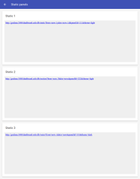
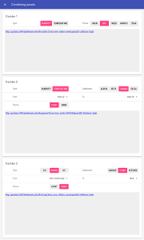
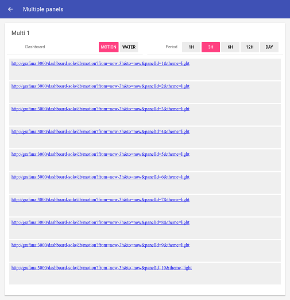
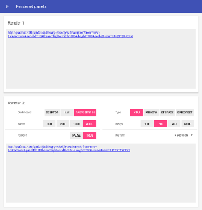

# openhab-grafana

[](https://travis-ci.com/wborn/openhab-grafana)
[](https://github.com/wborn/openhab-grafana/blob/master/LICENSE)
[](https://github.com/wborn/openhab-grafana/releases)

This project provides a JavaScript library with examples to simplify embedding [Grafana](https://grafana.net) panels in [openHAB 2](http://www.openhab.org) (OH) and its derivatives.


The library provides the following functionality:

* Generation of Grafana embedded panel URL parameters based on the state of OH items (using REST and subscribing to [Server-sent events (SSE)](https://en.wikipedia.org/wiki/Server-sent_events))
* Smart parameter resolution (more on that later)
* Debug mode for debugging URL generation

This functionality solves the issue of having to create a `Webview` with a `visibility=[..]` configuration for user customizable Grafana panel parameters.
The resulting sitemaps have less duplication and page load times decrease because a only single `Webview` has to be loaded.


## Requirements

* openHAB (OH) installation, e.g. follow: https://www.openhab.org/docs/installation/
* Grafana installation/configuration, e.g. follow: https://community.openhab.org/t/influxdb-grafana-persistence-and-graphing/13761
* **OH and Grafana accessible via the same host/port to prevent [Same-origin policy](https://en.wikipedia.org/wiki/Same-origin_policy) violations.** E.g. setup a reverse proxy using the [configuration examples](#reverse-proxy-configuration) below.


## Library objects, their parameters and how they are resolved

The library consists of two kinds of objects:

* `OHSubscriber`: resolves initial OH item values and listens for item value changes
* `GrafanaPanel`: keeps track of the properties of a Grafana panel properties, the enclosing `<iframe>` tag and updates the `<iframe>` source URL when OH item values change.

A `OHSubscriber` instance is always created when the JavaScript of the library loaded.
`GrafanaPanel` objects are created using JavaScript.
The utility method `addGrafanaPanel(uniqueId, grafanaPanelParameters)` can be used to create and add a Grafana panel to the `<body>` of the HTML document.

Library objects require some parameters for their functionality.
These parameters are resolved in the following order:

1. JavaScript object constructor arguments
2. query parameters of the HTML document, the URL of the document that is loaded in a OH `Webview`
3. query parameters of the parent HTML document, the URL of OH itself
4. the `OHG_DEFAULTS` defined in [openhab-grafana.js](web-src/openhab-grafana.js)


### `OHSubscriber` parameters

The `OHSubscriber` typically resolves its parameters from the OH URL.
These parameters can be manually added to the browser URL when showing the page outside of OH.

| Parameter name | Comment                                  |
|----------------|------------------------------------------|
| w              | the subscription page, e.g. "0002"       |
| sitemap        | the subscription sitemap, e.g. "default" |


### `GrafanaPanel` parameters

| Parameter name        | Comment                                                                                              |
|-----------------------|------------------------------------------------------------------------------------------------------|
| frame                 | the unique identifier of the `<iframe>` tag in which the panel is shown, e.g. "panel-123-frame" when the panel is created with `addGrafanaPanel("123")` |
| urlPrefix             | the prefix to use for generating Grafana panel URLs, e.g. "http://grafana:3000"                      |
| panelPath             | the panel path in Grafana panel URLs, e.g. "/dashboard-solo/db/"                                     |
| renderPanelPath       | the rendered path in Grafana panel URLs, e.g. "/render/dashboard-solo/db/"                           |
|                       |                                                                                                      |
| debug                 | shows the generated URL instead of the panel when set to "true"                                      |
| debugItem             | the name of the OH item used for resolving the debug value, e.g. "Combo2_Debug"                      |
| debugItemFunction     | the function for mapping the `debugItem` value to "true" or "false" (JavaScript only)                |
|                       |                                                                                                      |
| dashboard             | static definition of the Grafana dashboard name, e.g. "motion"                                       |
| dashboardItem         | the name of the OH item used for resolving the dashboard Grafana URL value, e.g. "Combo2_Dashboard"  |
| dashboardItemFunction | the function for mapping the `dashboardItem` value to a Grafana URL value (JavaScript only)          |
|                       |                                                                                                      |
| from                  | static definition of the `from=` Grafana URL value, e.g. "now-1w"                                    |
| fromItem              | the name of the OH item used for resolving the `from=` value, e.g. "Combo2_From"                     |
| fromItemFunction      | the function for mapping the `fromItem` value to a Grafana URL value (JavaScript only)               |
|                       |                                                                                                      |
| to                    | static definition of the `to=` Grafana URL value, e.g. "now"                                         |
| toItem                | the name of the OH item used for resolving the `to=` value, e.g. "Combo2_To"                         |
| toItemFunction        | the function for mapping the `toItem` value to a Grafana URL value (JavaScript only)                 |
|                       |                                                                                                      |
| panel                 | static definition of the `panelId=` Grafana URL value, e.g. "5"                                      |
| panelItem             | the name of the OH item used for resolving the `panelId=` value, e.g. "Combo2_Panel"                 |
| panelItemFunction     | the function for mapping the `panelItem` value to a Grafana URL value (JavaScript only)              |
|                       |                                                                                                      |
| theme                 | static definition of the `theme=` Grafana URL value, e.g. "light"                                    |
| themeItem             | the name of the OH item used for resolving the `theme=` value, e.g. "Combo2_Theme"                   |
| themeItemFunction     | the function for mapping the `themeItem` value to a Grafana URL value (JavaScript only)              |
|                       |                                                                                                      |
| render                | makes Grafana render an image of the panel, use "true" or "false", when set to "true" the width, height and refresh parameters are used |
| renderItem            | the name of the OH item used for resolving the render value, e.g. "Render2_Render"                   |
| renderItemFunction    | the function for mapping the `renderItem` value to "true" or "false" (JavaScript only)               |
|                       |                                                                                                      |
| width                 | static definition of the `width=` Grafana URL value, e.g. "1000" (only used when render is "true", use `width=auto` to use the width of the frame |
| widthItem             | the name of the OH item used for resolving the `width=` value, e.g. "Render2_Width"                  |
| widthItemFunction     | the function for mapping the `widthItem` value to a number or "auto" (JavaScript only)               |
|                       |                                                                                                      |
| height                | static definition of the `height=` Grafana URL value, e.g. "300" (only used when render is "true", use `height=auto` to use the height of the frame |
| heightItem            | the name of the OH item used for resolving the `height=` value, e.g. "Render2_Height"                |
| heightItemFunction    | the function for mapping the `heightItem` value to a number or "auto" (JavaScript only)              |
|                       |                                                                                                      |
| refresh               | static definition of the refresh interval for a rendered panel in milliseconds, e.g. "60000" for refreshing every minute, use "0" to disable |
| refreshItem           | the name of the OH item used for resolving the refresh value, e.g. "Render2_Refresh"                 |
| refreshItemFunction   | the function for mapping the `refreshItem` value to a number (JavaScript only)                       |


## Grafana time units

The Grafana [documentation](http://docs.grafana.org/reference/timerange/#time-units) has an overview with the time units that can be used with the `from=` and `to=` URL values.


## Demo

A demo is included that has some examples on how to use the library.
A Grafana installation is not required for the demo, because it uses the library in debug mode.
In this mode it does not load Grafana panels.
Instead it shows the generated panel URLs.

To run the demo:

1. add the files in the [example](example/) directory to the `/conf/` directory of an existing openHAB 2 installation
2. start the demo by opening the grafana sitemap, e.g. navigate to: [http://localhost:8080/basicui/app?sitemap=grafana](http://localhost:8080/basicui/app?sitemap=grafana)


### Demo screenshots

Click on a thumbnail below to zoom in on a demo page.

| Main menu                                             |
|-------------------------------------------------------|
| [](doc/main.png)       |


| Static panels                                         | Combining panels                                      |
|-------------------------------------------------------|-------------------------------------------------------|
| [](doc/static.png) | [](doc/combo.png)    |


| Multiple panels                                       | Rendered panels                                       |
|-------------------------------------------------------|-------------------------------------------------------|
| [](doc/multi.png)    | [](doc/render.png) |


### Static panels

These three panels are created using the same [demo.html](example/html/demo.html) file:

```html
<!DOCTYPE html>
<html>
<head>
    <meta http-equiv="Content-type" CONTENT="text/html; charset=utf-8">
    <link rel="stylesheet" type="text/css" href="panel-300px.css" />
    <script src="openhab-grafana.js"></script>
    <script src="openhab-grafana-user-defaults.js"></script>
</head>

<body>
</body>

<script>
    addGrafanaPanel();
</script>

</html>
```

This allows for reusing the same CSS and some Grafana defaults defined in [openhab-grafana-user-defaults.js](example/html/openhab-grafana-user-defaults.js).

Because of these defaults, the `urlPrefix` is automatically added and the `light` Grafana theme is used even though they are not defined in the `Webview` URLs in [grafana.sitemap](example/sitemaps/grafana.sitemap).
The URL of the *Static 3* `Webview` in the sitemap also specifies `theme=dark` which overrides the `light` default.

By using the debug mode, the library only shows the generated URLs and not the actual pages.
This mode can disabled by commenting the debug line in [openhab-grafana-user-defaults.js](example/html/openhab-grafana-user-defaults.js).
In debug mode clicking on a generated link loads the actual Grafana panel.
When debug mode is disabled, it can be reenabled for a particular `Webview` by adding `&debug=true` its respective URL.
It can also be reenabled by adding `&debug=true` to your browser URL, e.g.: [http://localhost:8080/basicui/app?w=0000&sitemap=grafana&debug=true](http://localhost:8080/basicui/app?w=0000&sitemap=grafana&debug=true)


### Combining panels

On this page the Grafana URL panel parameters are generated by the library using the state of OH items.
There are only two `Webview`s on this page.
Without the library, for each parameter combination a `Webview` with a `visibility=[..]` expression needs to be added to the sitemap.
For *Combo 2* this would have resulted in `2*4*5*6*2 = 480` `Webview`s being added to the sitemap.
It would also take a lot of time to load such a page.

Using OH items as Grafana panel URL parameters is done by adding their names to the URL of a `Webview`.
For instance *Combo 2* uses the following `Webview` definition:

```javascript
Webview url="/static/demo-combo2.html?dashboardItem=Combo2_Dashboard&fromItem=Combo2_From&toItem=Combo2_To&panelItem=Combo2_Panel&themeItem=Combo2_Theme" height=9
```

The library retrieves the initial values of these items using a REST call.
It also subscribes to sitemap events so it can update them when they are changed.
A JavaScript function can be defined to map OH item values to Grafana panel parameter values.

This is straightforward and for instance done in [demo-combo2.html](example/html/demo-combo2.html) using:

```javascript
var fromToItemFunction = function(value) {
    switch (value) {
        case "NOW": 
            return "now";
        case "HOUR": 
            return "now-1h";
        case "DAY":
            return "now-1d";
        default: 
        case "WEEK":
            return "now-1w";
        case "MONTH":
            return "now-1M";
        case "YEAR":
            return "now-1y";
    }
}

var panelItemFunction = function(value) {
    switch (value) {
        case "HUMIDITY": 
            return "1";
        default: 
        case "TEMPERATURE":
            return "2";
    }
}

addGrafanaPanel("combination", {
    fromItemFunction: fromToItemFunction,
    toItemFunction: fromToItemFunction,
    panelItemFunction: panelItemFunction,
});
```

*Combo 3* shows how to completely work without JavaScript functions for mapping item values to URL values.
This can be done by using the Grafana URL values with double quotes `"` in the [grafana.sitemap](example/sitemaps/grafana.sitemap) mappings.
This also allows for reusing the same HTML page ([demo.html](example/html/demo.html)) for a lot of `Webview`s.


### Multiple panels

This page shows how a JavaScript for loop is used to show several panels of the same dashboard in the same `Webview`.
The panel numbers are calculated and added in [demo-multi1.html](example/html/demo-multi1.html) as follows:

```javascript
for (var i = 1; i <= 10; i++) {
    addGrafanaPanel(i, {
        panel: i
    });
}
```

Generated panel tags all have a unique identifier that can be used for CSS styling.
The identifiers are based on the first parameter of the `addGrafanaPanel` function.
In this example the library generates:

* `panel-1-frame`, `panel-2-frame`, ... for Grafana panel `<iframe>` tags
* `panel-1-container`, `panel-2-container`, ... for the `<div>` tags enclosing the corresponding `<iframe>` tags

### Rendered panels

This page shows how the library is used to generate URLs for rendered Grafana panels.
*Render 1* again uses [demo.html](example/html/demo.html) and a static parameter definition for the `Webview` URL in [grafana.sitemap](example/sitemaps/grafana.sitemap):

```javascript
Webview url="/static/demo.html?dashboard=wifireception&from=now-1w&to=now&panel=10&width=600&height=300&render=true&refresh=5000" height=9
```

A rendered panel image is used when the URL contains `render=true`.
To let the library calculate the width and height of a panel use `width=auto` and `height=auto`.
It will then use the width and height of the frame for the Grafana URL values.
The `refresh=5000` URL parameter makes the library reload the Grafana panel image every 5 seconds.
Refresh can be disabled by omitting the value or by using `refresh=0`.

*Render 2* shows how OH item values can be used for customizing the render, width, height and  refresh parameters.


## Reverse proxy configuration

When the Grafana panels do not properly update this is most likely caused by 
[Same-origin policy](https://en.wikipedia.org/wiki/Same-origin_policy) violations.
These can be resolved by for instance configuring a reverse proxy on the same host/port that proxies traffic to openHAB and Grafana.

With the Apache2 and Nginx examples below Grafana will be accessible on `/grafana`, `htpasswd` is used for access control and SSL certificates for encrypting the data.
See also the [openHAB Security Documentation](https://www.openhab.org/docs/installation/security.html) for information on this subject.

Because Grafana runs on another port/URL with this reverse proxy setup don't forget to update the URL in [openhab-grafana-user-defaults.js](example/html/openhab-grafana-user-defaults.js) to something like the line below (where `hostname` is the IP/host you use in your browser): 

```javascript
OHG_DEFAULTS["urlPrefix"] = "https://hostname/grafana";
```

Grafana will also need to be reconfigured to use `/grafana` as root URL.
This is done by updating the root_url in grafana.ini (in `/etc/grafana`) to the configuration below and then restarting Grafana.

```
# The full public facing url you use in browser, used for redirects and emails
# If you use reverse proxy and sub path specify full url (with sub path)
root_url = %(protocol)s://%(domain)s/grafana/
```

The following sections contain configuration examples for Apache2 and Nginx.
After editing your configuration make sure to restart the Apache2 or Nginx to reload the configuration.
You should then be able to access both openHAB and Grafana via HTTPS on the same port in your browser using the reverse proxy (port 443 instead of 8080).

If you still run into any issues with this you can:

* Check your browser debug console (F12) for any errors
* Check the Grafana log file for any errors (`/var/log/grafana/grafana.log`)
* Restart openHAB, in the past there have been issues where newly added sitemap items were not properly updated in UIs
* Read the comments in [this issue](https://github.com/wborn/openhab-grafana/issues/5) which also contains some example error messages that are caused by Same-origin policy violations

### Apache2

With Apache2 you can create an enabled site with the configuration below.
In Debian based distributions (Ubuntu, openHABian, Raspbian) the enabled sites are usually stored in `/etc/apache2/sites-enabled`.

```
SSLStaplingCache shmcb:/tmp/stapling_cache(128000)

<VirtualHost _default_:443>
        ServerAdmin webmaster@localhost
        DocumentRoot /var/www/html

    RequestHeader set X-Forwarded-Proto "https"

    ErrorLog ${APACHE_LOG_DIR}/error.log
    CustomLog ${APACHE_LOG_DIR}/access.log combined

    SSLEngine on
    SSLCertificateFile      /etc/ssl-certs/domain.com/cert.pem
    SSLCertificateKeyFile   /etc/ssl-certs/domain.com/privkey.pem
    SSLCertificateChainFile /etc/ssl-certs/domain.com/chain.pem
    SSLUseStapling on

    RewriteEngine On

    <FilesMatch "\.(cgi|shtml|phtml|php)$">
            SSLOptions +StdEnvVars
    </FilesMatch>
    <Directory /usr/lib/cgi-bin>
            SSLOptions +StdEnvVars
    </Directory>

    <Location "/">
        AuthType Basic
        AuthName "Authentication"
        AuthUserFile "/etc/auth-basic/htpasswd"
        Require valid-user

        Order allow,deny
        Allow from all

        ProxyPass        http://localhost:8080/ retry=0 timeout=3600
        ProxyPassReverse http://localhost:8080/
    </Location>

    <Location "/grafana">
        AuthType Basic
        AuthName "Authentication"
        AuthUserFile "/etc/auth-basic/htpasswd"
        Require valid-user

        Order allow,deny
        Allow from all

        ProxyPass        http://localhost:3000 retry=0 timeout=3600
        ProxyPassReverse http://localhost:3000
    </Location>

    BrowserMatch "MSIE [2-6]" \
            nokeepalive ssl-unclean-shutdown \
            downgrade-1.0 force-response-1.0
    BrowserMatch "MSIE [7-9]" ssl-unclean-shutdown

</VirtualHost>
```

### Nginx

With Nginx you can add a server to your server configuration file.
In Debian based distributions (Ubuntu, openHABian, Raspbian) the enabled sites are usually stored in `/etc/nginx/sites-enabled`.

```
server {
    listen                          443 ssl;
    server_name                     _;

    ssl_certificate                 /etc/ssl-certs/domain.com/fullchain.pem;
    ssl_certificate_key             /etc/ssl-certs/domain.com/privkey.pem;

    auth_basic                      "Username and Password Required";
    auth_basic_user_file            /etc/auth-basic/htpasswd;

    location / {
        proxy_pass                            http://localhost:8080/;
        proxy_set_header Host                 $http_host;
        proxy_set_header X-Real-IP            $remote_addr;
        proxy_set_header X-Forwarded-For      $proxy_add_x_forwarded_for;
        proxy_set_header X-Forwarded-Proto    $scheme;
    }

    location /grafana/ {
        proxy_pass http://localhost:3000/;
    }
}
```


## Development

The JavaScript files in the repository are ready to be used with openHAB.
When modifying the library JavaScript code, use [Gulp](https://gulpjs.com/) for [linting](https://en.wikipedia.org/wiki/Lint_(software)) the code with [ESLint](https://eslint.org/) and to [minify](https://en.wikipedia.org/wiki/Minification_(programming)) it after making changes.

### Debian/Ubuntu

Node, NPM and Gulp can be installed using APT:

```shell
sudo apt install npm gulp
```

Open a shell and change the working directory (cd) to the root of the repository and execute:

```shell
npm install
gulp
```

### Maven

Alternatively there is a POM file in the repository which can be used for downloading Node, NPM and to run Gulp when Java and Maven are installed.
Open a shell and change the working directory (cd) to the root of the repository and execute:

```shell
mvn clean package
```
