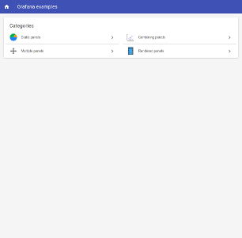

# smarthome-grafana

This project provides a JavaScript library with examples to simplify embedding [Grafana](https://grafana.net) panels in [Eclipse SmartHome](http://www.eclipse.org/smarthome) (ESH) and its derivatives like [openHAB 2](http://www.openhab.org) (OH2).

The library provides the following functionality:

* Generation of Grafana embedded panel URL parameters based on the state of ESH items (using REST and subscribing to server side events (SSE))
* Smart parameter resolution (more on that later)
* Debug mode for debugging URL generation

This functionality solves the issue of having to create a `Webview` with a `visibility=[..]` configuration for user customizable Grafana panel parameters. The resulting sitemaps have less duplication and page load times decrease because a only single `Webview` has to be loaded.


## Requirements

* Eclipse SmartHome installation, e.g. follow: http://docs.openhab.org/installation/index.html
* Grafana installation/configuration, e.g. follow: https://community.openhab.org/t/influxdb-grafana-persistence-and-graphing/13761


## Library objects, their parameters and how they are resolved

The library consists of two kinds of objects:

* `SmartHomeSubscriber`: resolves initial ESH item values and listens for item value changes
* `GrafanaPanel`: keeps track of the properties of a Grafana panel properties, the enclosing `<iframe>` tag and updates the `<iframe>` source URL when ESH item values change.

A `SmartHomeSubscriber` instance is always created when the JavaScript of the library loaded. `GrafanaPanel` objects are created using JavaScript. The utility method `addGrafanaPanel(uniqueId, grafanaPanelParameters)` can be used to create and add a Grafana panel to the `<body>` of the HTML document.

Library objects require some parameters for their functionality. These parameters are resolved in the following order:

1. JavaScript object constructor arguments
2. query parameters of the HTML document, the URL of the document that is loaded in a ESH `Webview`
3. query parameters of the parent HTML document, the URL of ESH itself
4. the `SMARTHOME_GRAFANA_DEFAULTS` defined in [smarthome-grafana.js](web-src/smarthome-grafana.js)


### `SmartHomeSubscriber` parameters

The `SmartHomeSubscriber` typically resolves its parameters from the ESH URL. These parameters can be manually added to the browser URL when showing the page outside of ESH.

| Parameter name | Comment                                  |
|----------------|------------------------------------------|
| w              | the subscription page, e.g. "0002"       |
| sitemap        | the subscription sitemap, e.g. "default" |


### `GrafanaPanel` parameters

| Parameter name        | Comment                                                                                              |
|-----------------------|------------------------------------------------------------------------------------------------------|
| debug                 | shows the generated URL instead of the panel when set to "true"                                      |
| frame                 | the unique identifier of the `<iframe>` tag in which the  panel is shown, e.g. "panel-123-frame" when the panel is created with `addGrafanaPanel("123")` |
| urlPrefix             | the prefix to use for generating Grafana panel URLs, e.g. "http://grafana:3000/dashboard-solo/db/"   |
| dashboard             | static definition of the Grafana dashboard name, e.g. "motion"                                       |
| dashboardItem         | the name of the ESH item used for resolving the dashboard Grafana URL value, e.g. "Combo2_Dashboard" |
| dashboardItemFunction | the function for mapping the `dashboardItem` value to a Grafana URL value (JavaScript only)          |
| from                  | static definition of the `from=` Grafana URL value, e.g. "now-7d"                                    |
| fromItem              | the name of the ESH item used for resolving the `from=` value, e.g. "Combo2_From"                    |
| fromItemFunction      | the function for mapping the `fromItem` value to a Grafana URL value (JavaScript only)               |
| to                    | static definition of the `to=` Grafana URL value, e.g. "now"                                         |
| toItem                | the name of the ESH item used for resolving the `to=` value, e.g. "Combo2_To"                        |
| toItemFunction        | the function for mapping the `toItem` value to a Grafana URL value (JavaScript only)                 |
| panel                 | static definition of the `panelId=` Grafana URL value, e.g. "5"                                      |
| panelItem             | the name of the ESH item used for resolving the `panelId=` value, e.g. "Combo2_Panel"                |
| panelItemFunction     | the function for mapping the `panelItem` value to a Grafana URL value (JavaScript only)              |
| theme                 | static definition of the `theme=` Grafana URL value, e.g. "light"                                    |
| themeItem             | the name of the ESH item used for resolving the `theme=` value, e.g. "Combo2_Theme"                  |
| themeItemFunction     | the function for mapping the `themeItem` value to a Grafana URL value (JavaScript only)              |


## Building 

Use [Grunt](http://gruntjs.com) to check the library code with eslint and minify it.


## Demo

A demo is included that has some examples on how to use the library. A Grafana installation is not required for the demo, because it uses the library in debug mode. In this mode it does not load Grafana panels. Instead it shows the generated panel URLs.

To run the demo:

1. add the files in the [example](example/) directory to the `/conf/` directory of an existing ESH/openHAB 2 installation
2. start the demo by opening the grafana sitemap, e.g. navigate to: [http://localhost:8080/basicui/app?sitemap=grafana](http://localhost:8080/basicui/app?sitemap=grafana)


### Demo screenshots

Click on a thumbnail below to zoom in on a demo page.

| Main Menu                                        | Static panels                                       |
|--------------------------------------------------|-----------------------------------------------------|
|[](doc/main.png)   |[](doc/static.png)|


| Combining panels                                 | Multiple panels                                     |
|--------------------------------------------------|-----------------------------------------------------|
|[](doc/combo.png)|[](doc/multi.png)   |


### Static panels

These three panels are created using the same [demo-static.html](example/html/demo-static.html) file:

```html
<!DOCTYPE html>
<html>
<head>
    <meta http-equiv="Content-type" CONTENT="text/html; charset=utf-8">
    <link rel="stylesheet" type="text/css" href="panel-300px.css" />
    <script src="smarthome-grafana.js"></script>
    <script src="smarthome-grafana-user-defaults.js"></script>
</head>

<body>
</body>

<script>
    addGrafanaPanel("static");
</script>

</html>
```

This allows for reusing the same CSS and some Grafana defaults defined in [smarthome-grafana-user-defaults.js](example/html/smarthome-grafana-user-defaults.js).

Because of these defaults, the `urlPrefix` is automatically added and the `light` Grafana theme is used even though they are not defined in the `Webview` URLs in [grafana.sitemap](example/sitemaps/grafana.sitemap). The URL of the *Static 3* `Webview` in the sitemap also specifies `theme=dark` which overrides the `light` default. 

By using the debug mode, the library only shows the generated URLs and not the actual pages. This mode can disabled by commenting the debug line in [smarthome-grafana-user-defaults.js](example/html/smarthome-grafana-user-defaults.js). In debug mode clicking on a generated link loads the actual Grafana panel. When debug mode is disabled, it can be reenabled for a particular `Webview` by adding `&debug=true` its respective URL. It can also be reenabled by adding `&debug=true` to your browser URL, e.g.: [http://localhost:8080/basicui/app?w=0000&sitemap=grafana&debug=true](http://localhost:8080/basicui/app?w=0000&sitemap=grafana&debug=true)


### Combining panels

On this page the Grafana URL panel parameters are generated by the library using the state of ESH items. There are only two `Webview`s on this page. Without the library, for each parameter combination a `Webview` with a `visibility=[..]` expression needs to be added to the sitemap. For *Combo 2* this would have resulted in `2*4*5*6*2 = 480` `Webview`s being added to the sitemap. It would also take a lot of time to load such a page.

Using ESH items as Grafana panel URL parameters is done by adding their names to the URL of a `Webview`. For instance *Combo 2* uses the following `Webview` definition:

```javascript
Webview url="/static/demo-combo2.html?dashboardItem=Combo2_Dashboard&fromItem=Combo2_From&toItem=Combo2_To&panelItem=Combo2_Panel&themeItem=Combo2_Theme" height=9
```

The library retrieves the initial values of these items using a REST call. It also subscribes to sitemap events so it can update them when they are changed. A JavaScript function can be defined to map ESH item values to Grafana panel parameter values.

This is straightforward and for instance done in [demo-combo2.html](example/html/demo-combo2.html) using:

```javascript
var fromToItemFunction = function(value) {
    switch (value) {
        case "NOW": 
            return "now";
        case "HOUR": 
            return "now-1h";
        case "DAY":
            return "now-1d";
        default: 
        case "WEEK":
            return "now-7d";
        case "MONTH":
            return "now-30d";
        case "YEAR":
            return "now-1y";
    }
}

var panelItemFunction = function(value) {
    switch (value) {
        case "HUMIDITY": 
            return "1";
        default: 
        case "TEMPERATURE":
            return "2";
    }
}

addGrafanaPanel("combination", {
    fromItemFunction: fromToItemFunction,
    toItemFunction: fromToItemFunction,
    panelItemFunction: panelItemFunction,
});
```


### Multiple panels

This page shows how a JavaScript for loop is used to show several panels of the same dashboard in the same `Webview`. The panel numbers are calculated and added in [demo-multi1.html](example/html/demo-multi1.html) as follows:

```javascript
var fromItemFunction = function(value) {
    switch (value) {
        case "1HOUR": 
            return "now-1h";
        default: 
        case "3HOURS": 
            return "now-3h";
        case "6HOURS": 
            return "now-6h";
        case "12HOURS": 
            return "now-12h";
        case "1DAY":
            return "now-1d";
    }
}

for (var i = 1; i <= 10; i++) {
    addGrafanaPanel(i, {
        fromItemFunction: fromItemFunction,
        panel: i
    });
}
```

Generated panel tags all have a unique identifier that can be used for CSS styling. The identifiers are based on the first parameter of the `addGrafanaPanel` function. In this example the library generates:

* `panel-1-frame`, `panel-2-frame`, ... for Grafana panel `<iframe>` tags
* `panel-1-container`, `panel-2-container`, ... for the `<div>` tags enclosing the corresponding `<iframe>` tags
